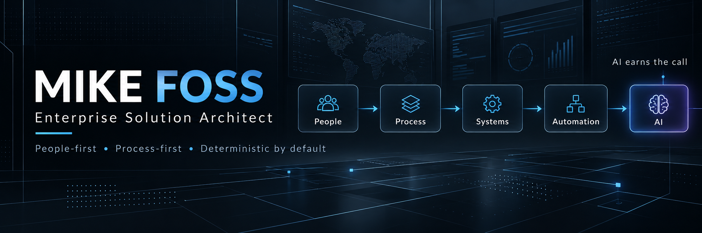
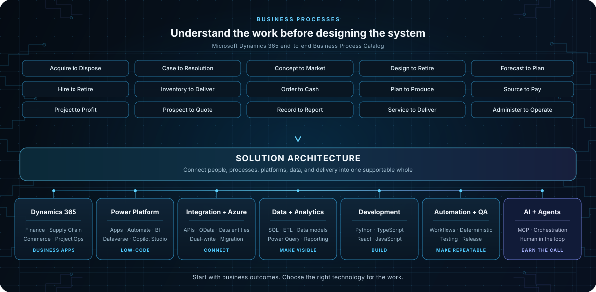
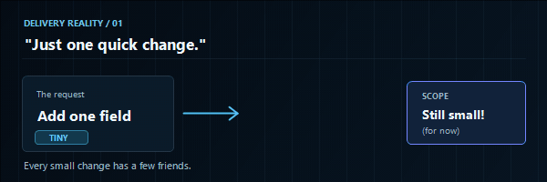
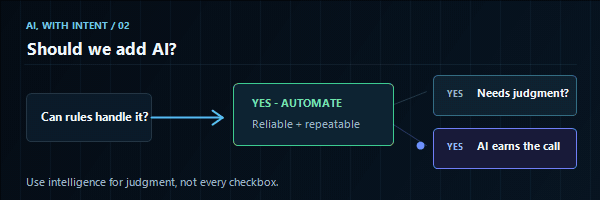
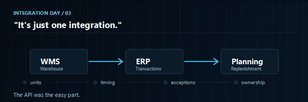

  

<strong>People | Process | Technology</strong>

I design enterprise systems that turn messy business reality into clear, maintainable, repeatable capability.
My work sits at the intersection of solution architecture, supply chain, Dynamics 365 Finance & Supply Chain Management, Power Platform, automation, and AI-assisted applications. I care less about shiny technology than whether a solution is understandable, secure, supportable, measurable, and actually useful to the people running the business.
## Business + Technology Architecture

I work across the solution lifecycle: understand how the business operates, then shape the architecture, platforms, integrations, data, automation, validation, and adoption around it. The goal is useful, supportable capability, not technology for its own sake.

### Dynamics 365 business processes

Microsoft's end-to-end Business Process Catalog describes work across applications, not just product modules. These scenarios are a useful map for connecting operational needs to solution design.

  

### Dynamics 365 + Microsoft business applications

**Dynamics 365 Finance & Supply Chain Management** 
└─Finance · └─Procurement · └─Sales · └─Inventory · └─Advanced Warehouse Management · └─Warehouse-only mode · └─Manufacturing · └─Planning Optimization · └─Asset Management · └─Transportation · └─Product Information Management · └─Cost Management · └─Landed Cost · └─Project Operations · └─Commerce · Retail

**Power Platform** 
└─Power Apps · └─Power Automate · └─Power BI · └─Dataverse · └─Copilot Studio · └─Custom Connectors · └─Solution Architecture · └─ALM

**Enterprise integration & delivery** 
└─Azure DevOps · └─GitHub · └─REST APIs · └─OData · └─Data Entities · └─Dual-write · └─Integration Architecture · └─Data Migration · └─Environment Strategy · └─Application Lifecycle Management · └─Testing & Release Management

### A few familiar moments in enterprise delivery

<table>
<tr>
<td width="33%" align="center"></td>
<td width="33%" align="center"></td>
<td width="33%" align="center"></td>
</tr>
</table>

POC's or Not Just some Projects I am working on in free time 
<table>
<tr>
<td width="50%" valign="top">

KIVO Studio
Knowledge • Intelligence • Validation • Orchestration
A people-first, process-first architecture for building AI-assisted systems without turning every problem into an LLM call.
Focus
- deterministic-by-default execution
- human approval gates
- transparent tool use
- reusable software over repeated prompting
- validation before delivery
</td>
<td width="50%" valign="top">

D365 implementation tooling
Tools and accelerators that make enterprise delivery easier to understand and operate.
Examples
- ADO control and backlog tooling
- FDD / SDD generation workflows
- D365 configuration guidance
- warehouse and planning utilities
- test automation and environment tooling
</td>
</tr>
<tr>
<td width="50%" valign="top">

Supply chain applications
Planning and execution tools that bridge business decisions with ERP transactions.
Areas
- inventory visibility
- transfer planning
- warehouse orchestration
- replenishment
- manufacturing and planning
- operational decision support
</td>
<td width="50%" valign="top">

AI-assisted applications
I use AI where reasoning adds value, then convert repeatable behavior into software whenever possible.
Pattern
Reason once → Validate → Reuse many
The goal is not “more AI.” The goal is better systems.
</td>
</tr>
</table>

Current focus
SYSTEMS ONLINE
├─ D365 FSCM architecture & implementation
├─ Warehouse Management / Warehouse-only mode
├─ Supply chain planning applications
├─ MCP + agent orchestration
├─ Human-in-the-loop validation
├─ React / TypeScript enterprise UX
└─ Converting repeated AI behavior into reusable capability
How I work
└─Principle	What it means in practice
 └─People first	Start with users, decisions, ownership, and outcomes.
  └─Process first	Understand the workflow before automating it.
   └─Deterministic by default	If software or rules can solve it reliably, use them.
    └─AI earns the call	Use intelligence where judgment, interpretation, or synthesis is actually needed.
     └─Validation matters	Make outputs inspectable before they affect the business.
      └─Build for reuse	Turn successful behavior into maintainable capability.

## Engineering + Data Toolkit

### Development

  

`Python` · `SQL` · `VBA` · `TypeScript` · `JavaScript` · `React` · `HTML` · `CSS` · `Vite` · `Next.js` · `Tailwind` · `GitHub Actions`

<table>
<tr>
<td width="50%" valign="top">

### 📊 Data + Analytics
*Operational records &rarr; Trusted decision intelligence*

├─ **Architecture &amp; Modeling** 
&nbsp;&nbsp;&nbsp;&nbsp;└─ `SQL` · `Data Modeling` · `Data Analysis` 
├─ **Pipelines &amp; Transformation** 
&nbsp;&nbsp;&nbsp;&nbsp;└─ `ETL` · `Data Transformation` · `Power Query` 
└─ **Reporting &amp; Visibility** 
&nbsp;&nbsp;&nbsp;&nbsp;└─ `Power BI` · `Excel` · `Reporting` · `Visualization`

</td>
<td width="50%" valign="top">

### 🤖 Automation + AI
*Deterministic by default · Intelligence when judgment adds value*

├─ **Agentic &amp; Context Systems** 
&nbsp;&nbsp;&nbsp;&nbsp;└─ `MCP` · `Agents` · `Prompt / context engineering` 
├─ **Orchestration &amp; Governance** 
&nbsp;&nbsp;&nbsp;&nbsp;└─ `Tool orchestration` · `Human-in-the-loop systems` · `Evals` 
└─ **Repeatable Execution** 
&nbsp;&nbsp;&nbsp;&nbsp;└─ `Deterministic automation` · `Workflow automation` · `AI-assisted applications`

</td>
</tr>
<tr>
<td width="50%" valign="top">

### 🏛️ Architecture + Delivery
*Business intent &rarr; Scalable, governed enterprise capability*

├─ **Strategy &amp; Scoping** 
&nbsp;&nbsp;&nbsp;&nbsp;└─ `Business Analysis` · `Requirements Engineering` · `Fit-to-Standard` · `Fit/Gap Analysis` 
├─ **System Architecture** 
&nbsp;&nbsp;&nbsp;&nbsp;└─ `Enterprise Architecture` · `Solution Architecture` · `Process Design` · `Integration Design` 
└─ **Governance &amp; Quality** 
&nbsp;&nbsp;&nbsp;&nbsp;└─ `Governance` · `Security` · `Testing` · `Documentation` · `Implementation Strategy`

</td>
<td width="50%" valign="top">

### 📦 Supply Chain + Operations
*Physical operations &harr; Enterprise ERP transactions*

├─ **Warehousing &amp; Fulfillment** 
&nbsp;&nbsp;&nbsp;&nbsp;└─ `Warehousing` · `Distribution` · `Transportation` 
├─ **Planning &amp; Replenishment** 
&nbsp;&nbsp;&nbsp;&nbsp;└─ `Demand Planning` · `Supply Planning` · `Replenishment` 
└─ **Manufacturing &amp; Control** 
&nbsp;&nbsp;&nbsp;&nbsp;└─ `Manufacturing` · `Inventory` · `Procurement` · `Order Management` · `Product Management` · `Costing`

</td>
</tr>
</table>

## Elsewhere

- 🌐 Website: [Fossome](https://fossome.net)
- 💼 LinkedIn: [Mike Foss](https://www.linkedin.com/in/mike-foss-5507a235/)
- 🧭 GitHub: you are already here

  Architecture is where business intent stops being a slide and starts becoming a system.

